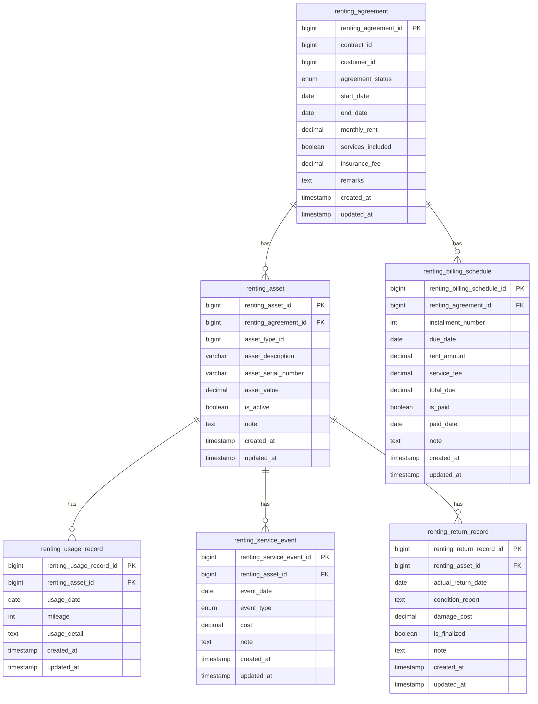

# Core Lending & Renting Service

[](https://openjdk.java.net/)
[](https://spring.io/projects/spring-boot)
[](https://maven.apache.org/)
[](https://www.postgresql.org/)
[](https://docs.spring.io/spring-framework/reference/web/webflux.html)
[](https://r2dbc.io/)
[](https://opensource.org/licenses/Apache-2.0)

A microservice component of the Firefly platform that manages renting and operating lease agreements, assets, billing schedules, and related operations.

## Table of Contents

- [Overview](#overview)
- [Features](#features)
- [Architecture](#architecture)
  - [Modules](#modules)
  - [Technologies](#technologies)
- [Getting Started](#getting-started)
  - [Prerequisites](#prerequisites)
  - [Environment Variables](#environment-variables)
  - [Building the Application](#building-the-application)
  - [Running the Application](#running-the-application)
- [API Documentation](#api-documentation)
  - [Main Endpoints](#main-endpoints)
- [Development](#development)
  - [Project Structure](#project-structure)
  - [Database Migrations](#database-migrations)
  - [Database ER Diagram](#database-er-diagram)
  - [Profiles](#profiles)
- [Deployment](#deployment)
  - [Docker](#docker)
  - [Kubernetes](#kubernetes)
- [Monitoring](#monitoring)
- [Contributing](#contributing)
- [License](#license)

## Overview

The Core Lending & Renting Service is responsible for managing the entire lifecycle of renting agreements, from creation to termination. It handles assets that can be rented, billing schedules, usage records, and return records. This service is built with a reactive architecture using Spring WebFlux and R2DBC for non-blocking database operations.

## Features

- Manage renting agreements (create, update, retrieve, delete)
- Track rented assets and their status
- Generate and manage billing schedules
- Record asset usage and returns
- Process renting-related events
- RESTful API with OpenAPI documentation

## Architecture

The service follows a modular architecture with clear separation of concerns:

### Modules

- **core-lending-renting-interfaces**: Contains DTOs, interfaces, and enums that define the service's API
- **core-lending-renting-models**: Contains database entities and repositories
- **core-lending-renting-core**: Contains business logic and service implementations
- **core-lending-renting-web**: Contains REST controllers and application configuration

### Technologies

- **Java 21**: Utilizing the latest Java features including virtual threads
- **Spring Boot 3**: Framework for building production-ready applications
- **Spring WebFlux**: Reactive web framework for building non-blocking applications
- **R2DBC**: Reactive Relational Database Connectivity for non-blocking database operations
- **PostgreSQL**: Relational database for data persistence
- **Flyway**: Database migration tool
- **OpenAPI/Swagger**: API documentation
- **Maven**: Build and dependency management

## Getting Started

### Prerequisites

- JDK 21
- Maven 3.8+
- Docker (for containerization)
- PostgreSQL 15+

### Environment Variables

The following environment variables need to be set:

```
DB_HOST=localhost
DB_PORT=5432
DB_NAME=renting_db
DB_USERNAME=postgres
DB_PASSWORD=postgres
DB_SSL_MODE=disable
```

### Building the Application

```bash
mvn clean install
```

### Running the Application

#### Using Maven

```bash
mvn spring-boot:run -pl core-lending-renting-web
```

#### Using Docker

```bash
docker build -t core-lending-renting .
docker run -p 8080:8080 --env-file .env core-lending-renting
```

## API Documentation

When the application is running, the API documentation is available at:

- Swagger UI: http://localhost:8080/swagger-ui.html
- OpenAPI JSON: http://localhost:8080/v3/api-docs

### Main Endpoints

- `/api/v1/renting-agreements`: Manage renting agreements
- `/api/v1/renting-assets`: Manage assets available for renting
- `/api/v1/renting-billing-schedules`: Manage billing schedules
- `/api/v1/renting-return-records`: Manage asset return records
- `/api/v1/renting-usage-records`: Manage asset usage records
- `/api/v1/renting-service-events`: Manage renting-related events

## Development

### Project Structure

```
core-lending-renting/
├── core-lending-renting-interfaces/    # DTOs and interfaces
├── core-lending-renting-models/        # Database entities and repositories
├── core-lending-renting-core/          # Business logic and services
├── core-lending-renting-web/           # REST controllers and application config
├── Dockerfile                          # Docker configuration
└── pom.xml                             # Maven parent configuration
```

### Database Migrations

Database migrations are managed with Flyway and are located in:

```
core-lending-renting-models/src/main/resources/db/migration/
```

### Database ER Diagram

The following diagram shows the entity relationships in the database:



### Profiles

The application supports multiple profiles:

- **dev**: Development environment with detailed logging
- **testing**: Testing environment with Swagger enabled
- **prod**: Production environment with minimal logging and Swagger disabled

## Deployment

### Docker

The service can be deployed as a Docker container. The Dockerfile is provided in the root directory.

### Kubernetes

For Kubernetes deployment, use the provided Kubernetes manifests (not included in this repository).

## Monitoring

The service exposes the following actuator endpoints:

- `/actuator/health`: Health information
- `/actuator/info`: Application information
- `/actuator/prometheus`: Metrics for Prometheus

## Contributing

1. Fork the repository
2. Create a feature branch (`git checkout -b feature/amazing-feature`)
3. Commit your changes (`git commit -m 'Add some amazing feature'`)
4. Push to the branch (`git push origin feature/amazing-feature`)
5. Open a Pull Request

## License

This project is licensed under the Apache License 2.0 - see the [LICENSE](LICENSE) file for details.

```
Copyright © 2023 Catalis

Licensed under the Apache License, Version 2.0 (the "License");
you may not use this file except in compliance with the License.
You may obtain a copy of the License at

    http://www.apache.org/licenses/LICENSE-2.0

Unless required by applicable law or agreed to in writing, software
distributed under the License is distributed on an "AS IS" BASIS,
WITHOUT WARRANTIES OR CONDITIONS OF ANY KIND, either express or implied.
See the License for the specific language governing permissions and
limitations under the License.
```
