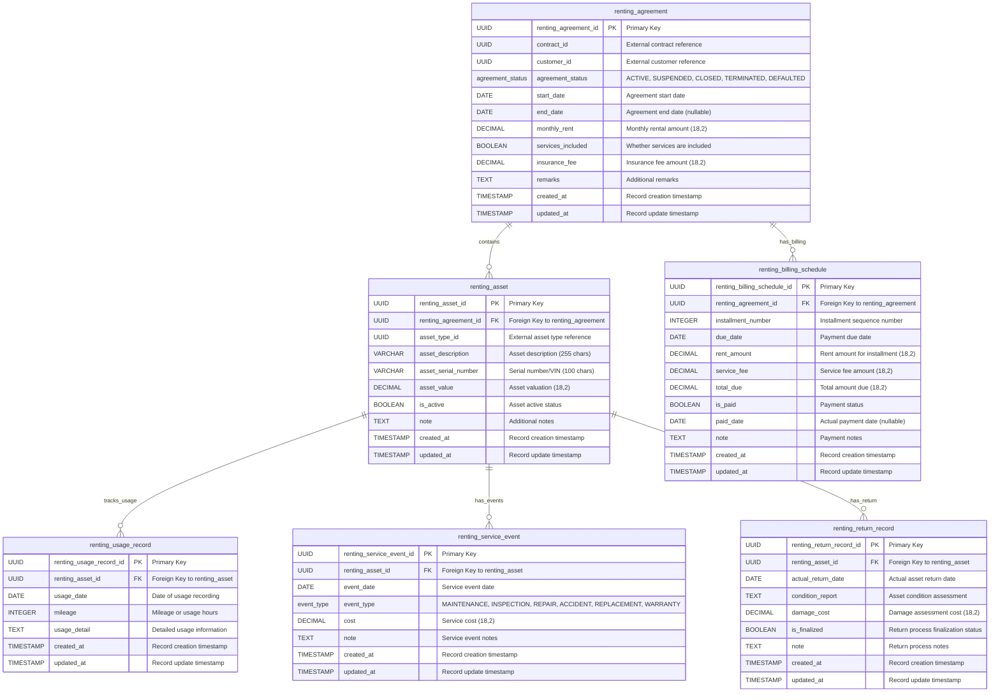

# Core Lending & Renting Service

[](https://openjdk.java.net/)
[](https://spring.io/projects/spring-boot)
[](https://maven.apache.org/)
[](https://www.postgresql.org/)
[](https://docs.spring.io/spring-framework/reference/web/webflux.html)
[](https://r2dbc.io/)
[](https://opensource.org/licenses/Apache-2.0)

A reactive microservice component of the **Firefly OpenCore Banking Platform** that manages operating lease agreements, asset rentals, billing schedules, usage tracking, and maintenance events. Built with modern Java technologies and reactive programming principles.

## Table of Contents

- [Overview](#overview)
- [Features](#features)
- [Architecture](#architecture)
  - [Modules](#modules)
  - [Technologies](#technologies)
- [Getting Started](#getting-started)
  - [Prerequisites](#prerequisites)
  - [Environment Variables](#environment-variables)
  - [Building the Application](#building-the-application)
  - [Running the Application](#running-the-application)
- [API Documentation](#api-documentation)
  - [Main Endpoints](#main-endpoints)
- [Development](#development)
  - [Project Structure](#project-structure)
  - [Database Migrations](#database-migrations)
  - [Database ER Diagram](#database-er-diagram)
  - [Profiles](#profiles)
- [Testing](#testing)
- [Deployment](#deployment)
- [Monitoring](#monitoring)
- [Contributing](#contributing)
- [License](#license)

## Overview

The **Core Lending & Renting Service** is a critical microservice within the Firefly OpenCore Banking Platform, developed by **Firefly Software Solutions Inc**. This service manages the complete lifecycle of operating lease agreements, from initial contract creation through asset return and finalization.

The service provides comprehensive functionality for:
- **Operating Lease Management**: Full lifecycle management of rental agreements
- **Asset Tracking**: Real-time monitoring of rented assets and their status
- **Financial Operations**: Automated billing schedule generation and payment tracking
- **Usage Monitoring**: Detailed tracking of asset usage including mileage and operational hours
- **Maintenance Management**: Service event tracking for repairs, inspections, and maintenance
- **Return Processing**: Complete asset return workflow with condition assessment

Built with reactive programming principles, the service ensures high performance and scalability for enterprise banking operations.

## Features

### Core Functionality
- **Renting Agreement Management**: Create, update, retrieve, and manage operating lease agreements
- **Asset Management**: Track rented assets with detailed descriptions, serial numbers, and valuations
- **Billing Schedule Management**: Generate and manage installment-based billing schedules
- **Usage Record Tracking**: Monitor asset usage with mileage/hours tracking and detailed logs
- **Service Event Management**: Track maintenance, repairs, inspections, and warranty events
- **Return Record Management**: Process asset returns with condition reports and damage assessments

### Technical Features
- **Reactive Architecture**: Built with Spring WebFlux for non-blocking operations
- **UUID-based Identifiers**: All entities use UUID primary keys for distributed system compatibility
- **Comprehensive Validation**: Full DTO validation using lib-commons-validators
- **OpenAPI Documentation**: Complete API documentation with Swagger UI
- **Database Migrations**: Flyway-managed database schema evolution
- **Multi-profile Support**: Development, testing, and production configurations

## Architecture

The service follows a clean, modular architecture with clear separation of concerns and reactive programming principles:

### Modules

- **core-lending-renting-interfaces**: DTOs, enums, and interface definitions for API contracts
- **core-lending-renting-models**: Database entities, repositories, and data access layer
- **core-lending-renting-core**: Business logic, service implementations, and domain operations
- **core-lending-renting-web**: REST controllers, configuration, and web layer
- **core-lending-renting-sdk**: OpenAPI specifications and client SDK generation

### Technologies

- **Java 21**: Latest LTS version with virtual threads and modern language features
- **Spring Boot 3.2**: Production-ready application framework with auto-configuration
- **Spring WebFlux**: Reactive web framework for non-blocking, asynchronous operations
- **R2DBC**: Reactive database connectivity for PostgreSQL with connection pooling
- **PostgreSQL 15**: Enterprise-grade relational database with UUID support
- **Flyway**: Database migration and version control
- **OpenAPI 3.0**: API specification and documentation generation
- **Maven**: Build automation and dependency management
- **Lombok**: Code generation for reducing boilerplate

## Getting Started

### Prerequisites

- **JDK 21**: Latest LTS version with virtual threads support
- **Maven 3.8+**: Build automation and dependency management
- **PostgreSQL 15+**: Database server with UUID extension support
- **Docker** (optional): For containerized deployment

### Environment Variables

Configure the following environment variables for database connectivity:

```bash
# Database Configuration
DB_HOST=localhost
DB_PORT=5432
DB_NAME=core_lending_renting
DB_USERNAME=postgres
DB_PASSWORD=postgres
DB_SSL_MODE=disable

# Server Configuration (optional)
SERVER_ADDRESS=localhost
SERVER_PORT=8080
```

### Building the Application

Build the entire multi-module project:

```bash
mvn clean install
```

For faster builds during development (skip tests):

```bash
mvn clean install -DskipTests
```

### Running the Application

#### Using Maven (Development)

Run the application directly with Maven:

```bash
mvn spring-boot:run -pl core-lending-renting-web
```

#### Using Java JAR

Build and run the executable JAR:

```bash
mvn clean package -DskipTests
java -jar core-lending-renting-web/target/core-lending-renting-web-1.0.0-SNAPSHOT.jar
```

#### Using Docker (if Dockerfile exists)

```bash
docker build -t firefly/core-lending-renting .
docker run -p 8080:8080 --env-file .env firefly/core-lending-renting
```

## API Documentation

The service provides comprehensive OpenAPI 3.0 documentation with interactive Swagger UI.

### Access Points

When the application is running, access the API documentation at:

- **Swagger UI**: http://localhost:8080/swagger-ui.html
- **OpenAPI Specification**: http://localhost:8080/v3/api-docs
- **OpenAPI YAML**: Available in `core-lending-renting-sdk/src/main/resources/api-spec/openapi.yml`

### Main Endpoints

The API follows RESTful principles with hierarchical resource organization:

#### Renting Agreements
- `GET /api/v1/renting-agreements` - List all renting agreements with filtering
- `POST /api/v1/renting-agreements` - Create a new renting agreement
- `GET /api/v1/renting-agreements/{id}` - Get specific renting agreement
- `PUT /api/v1/renting-agreements/{id}` - Update existing renting agreement
- `DELETE /api/v1/renting-agreements/{id}` - Delete renting agreement

#### Nested Resources
All other resources are organized under their parent agreements and assets:

- **Assets**: `/api/v1/renting-agreements/{agreementId}/renting-assets`
- **Billing Schedules**: `/api/v1/renting-agreements/{agreementId}/renting-billing-schedules`
- **Usage Records**: `/api/v1/renting-agreements/{agreementId}/renting-assets/{assetId}/renting-usage-records`
- **Service Events**: `/api/v1/renting-agreements/{agreementId}/renting-assets/{assetId}/renting-service-events`
- **Return Records**: `/api/v1/renting-agreements/{agreementId}/renting-assets/{assetId}/renting-return-records`

### API Features

- **UUID Identifiers**: All resources use UUID for distributed system compatibility
- **Pagination**: List endpoints support pagination with configurable page sizes
- **Filtering**: Advanced filtering capabilities on list endpoints
- **Validation**: Comprehensive request validation with detailed error messages
- **Idempotency**: Support for idempotent operations using `X-Idempotency-Key` header

## Development

### Project Structure

The project follows a clean, modular Maven multi-module architecture:

```
core-lending-renting/
├── core-lending-renting-interfaces/    # DTOs, enums, and API contracts
│   └── src/main/java/com/firefly/core/lending/renting/interfaces/
│       ├── dtos/                       # Data Transfer Objects with validation
│       └── enums/                      # Enumeration definitions
├── core-lending-renting-models/        # Database entities and repositories
│   └── src/main/java/com/firefly/core/lending/renting/models/
│       ├── entities/                   # JPA/R2DBC entities
│       └── repositories/               # Reactive repositories
├── core-lending-renting-core/          # Business logic and services
│   └── src/main/java/com/firefly/core/lending/renting/core/
│       ├── services/                   # Service implementations
│       └── mappers/                    # Entity-DTO mappers
├── core-lending-renting-web/           # REST controllers and configuration
│   └── src/main/java/com/firefly/core/lending/renting/web/
│       ├── controllers/                # REST API controllers
│       └── LendingRentingApplication.java  # Main application class
├── core-lending-renting-sdk/           # OpenAPI specifications
│   └── src/main/resources/api-spec/    # OpenAPI YAML definitions
└── pom.xml                             # Maven parent configuration
```

### Database Migrations

Database schema evolution is managed with **Flyway** migrations located in:

```
core-lending-renting-models/src/main/resources/db/migration/
├── V1__Create_Enums_And_Casts.sql     # Database enums and type casts
└── V2__Create_Tables.sql              # Main table definitions
```

#### Migration Files
- **V1**: Creates PostgreSQL enums (`agreement_status`, `event_type`) and type casts
- **V2**: Creates all main tables with UUID primary keys and foreign key relationships

### Database ER Diagram

The following diagram shows the complete entity relationships and attributes in the database:



#### Entity Relationships

- **renting_agreement** is the root entity representing an operating lease contract
- **renting_asset** represents physical assets under a rental agreement
- **renting_billing_schedule** manages payment installments for agreements
- **renting_usage_record** tracks asset usage (mileage, hours, etc.)
- **renting_service_event** records maintenance and service activities
- **renting_return_record** manages the asset return process

#### Key Design Features

- **UUID Primary Keys**: All entities use UUID for distributed system compatibility
- **Audit Timestamps**: All entities include `created_at` and `updated_at` fields
- **Enum Types**: PostgreSQL enums for `agreement_status` and `event_type`
- **Decimal Precision**: Financial amounts use DECIMAL(18,2) for precision
- **External References**: `contract_id` and `customer_id` reference external domains
- **Nullable Fields**: Optional fields like `end_date` and `paid_date` are nullable

### Profiles

The application supports multiple Spring profiles for different environments:

#### Development Profile (`dev`)
```bash
spring.profiles.active=dev
```
- **Logging**: DEBUG level for Firefly packages, R2DBC, and Flyway
- **Database**: Full SQL logging enabled
- **Swagger**: Enabled with full documentation

#### Testing Profile (`testing`)
```bash
spring.profiles.active=testing
```
- **Logging**: INFO level with DEBUG for Firefly packages
- **Database**: Minimal SQL logging
- **Swagger**: Enabled for API testing

#### Production Profile (`prod`)
```bash
spring.profiles.active=prod
```
- **Logging**: WARN level with INFO for Firefly packages
- **Database**: No SQL logging
- **Swagger**: Disabled for security

## Testing

### Running Tests

Execute the complete test suite:

```bash
mvn test
```

Run tests for a specific module:

```bash
mvn test -pl core-lending-renting-core
```

### Test Categories

- **Unit Tests**: Service layer and business logic testing
- **Integration Tests**: Database and repository testing with R2DBC
- **API Tests**: REST controller testing with WebTestClient
- **Validation Tests**: DTO validation and constraint testing

## Deployment

### Production Deployment

The service is designed for cloud-native deployment with the following considerations:

#### Environment Configuration
- Use environment variables for all configuration
- Enable virtual threads for improved performance
- Configure connection pooling for R2DBC
- Set appropriate JVM heap settings

#### Database Setup
- Ensure PostgreSQL 15+ with UUID extension
- Run Flyway migrations before application startup
- Configure read replicas for scaling if needed

#### Monitoring and Observability
- Enable Actuator endpoints for health checks
- Configure Prometheus metrics collection
- Set up application logging with structured format

## Monitoring

The service provides comprehensive monitoring and observability features:

### Actuator Endpoints

The following Spring Boot Actuator endpoints are available:

- **Health Check**: `/actuator/health` - Application and database health status
- **Application Info**: `/actuator/info` - Application metadata and version information
- **Metrics**: `/actuator/prometheus` - Prometheus-compatible metrics for monitoring

### Health Checks

The service includes:
- **Liveness Probe**: Indicates if the application is running
- **Readiness Probe**: Indicates if the application is ready to serve traffic
- **Database Health**: R2DBC connection pool health monitoring

### Metrics Collection

Key metrics exposed include:
- HTTP request metrics (duration, status codes, throughput)
- Database connection pool metrics
- JVM metrics (memory, garbage collection, threads)
- Custom business metrics for renting operations

## Contributing

We welcome contributions to the Core Lending & Renting Service! Please follow these guidelines:

### Development Process

1. **Fork the Repository**: Create your own fork of the project
2. **Create Feature Branch**: `git checkout -b feature/your-feature-name`
3. **Follow Code Standards**: Ensure code follows existing patterns and conventions
4. **Add Tests**: Include unit and integration tests for new functionality
5. **Update Documentation**: Update README and API documentation as needed
6. **Commit Changes**: Use clear, descriptive commit messages
7. **Push to Branch**: `git push origin feature/your-feature-name`
8. **Create Pull Request**: Submit a PR with detailed description of changes

### Code Standards

- Follow Java coding conventions and best practices
- Use Lombok annotations to reduce boilerplate code
- Implement comprehensive validation in DTOs
- Write reactive code using Spring WebFlux patterns
- Include proper error handling and logging

### Testing Requirements

- Maintain test coverage above 80%
- Include unit tests for all service methods
- Add integration tests for repository operations
- Test API endpoints with WebTestClient
- Validate all DTO constraints

## License

This project is part of the **Firefly OpenCore Banking Platform** and is licensed under the Apache License 2.0.

**Copyright © 2024 Firefly Software Solutions Inc**

Licensed under the Apache License, Version 2.0 (the "License");
you may not use this file except in compliance with the License.
You may obtain a copy of the License at

    http://www.apache.org/licenses/LICENSE-2.0

Unless required by applicable law or agreed to in writing, software
distributed under the License is distributed on an "AS IS" BASIS,
WITHOUT WARRANTIES OR CONDITIONS OF ANY KIND, either express or implied.
See the License for the specific language governing permissions and
limitations under the License.

---

**Firefly Software Solutions Inc**
- Website: [getfirefly.io](https://getfirefly.io)
- GitHub Organization: [firefly-oss](https://github.com/firefly-oss)
- Contact: dev@getfirefly.io

For more information about the Firefly OpenCore Banking Platform, visit our website or explore our other open-source projects.
